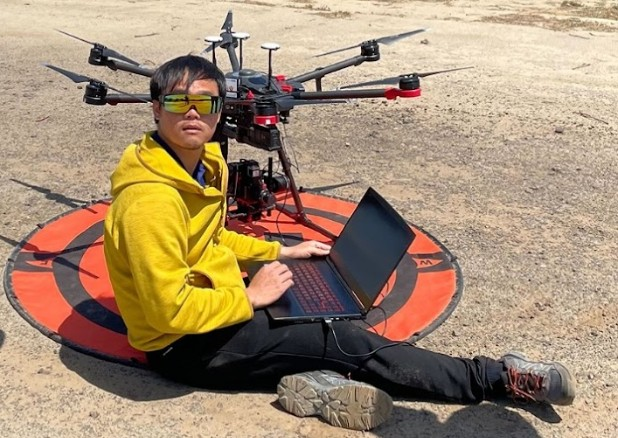

<!--
  GITHUB PROFILE README
  ---------------------
  1. Create a repository named EXACTLY your GitHub username (e.g. github.com/rosspeanusaha/rosspeanusaha)
  2. Put this file in it as  README.md
  3. Add your photo to the repo and rename the file below (currently "profile.jpg")
  4. Replace every  YOUR_GITHUB_USERNAME  with your actual username
-->

  

  <h1>Sirapoom &quot;Ross&quot; Peanusaha, PhD</h1>

  <h3>Environmental Data Scientist · Remote Sensing · Machine Learning</h3>

  
<em>Postdoctoral Research Associate @ Texas A&amp;M AgriLife Research</em>

  

    
    
    
    
    
  

---

## 🌱 About Me

- 🔬 Postdoctoral Research Associate at **Texas A&M AgriLife Research**, working on agricultural & livestock air-quality and environmental data science.
- 🎓 **PhD in Biological Systems Engineering**, University of California, Davis (2025).
- 🛰️ I build methods at the intersection of **statistics, remote sensing, and machine learning** — including AI models trained on physics-based simulation and augmented data, and how well they *transfer* to the real world.
- 🌍 From Thailand 🇹🇭 — studied and worked across the US, Costa Rica, and Israel.
- 💬 Ask me about hyperspectral imaging, radiative-transfer models, drone data pipelines, or running simulations on the cloud.
- 📫 Reach me: **s.peanusaha@gmail.com**

## 🔭 Research Interests

- **Applied remote sensing** — multi-scale integration of UAV (hyperspectral / multispectral / LiDAR) and satellite data for vegetation and environmental monitoring
- **Environmental data science** — machine learning, machine vision, and reproducible Python/R workflows for ecological problems
- **Transferable & simulation-trained AI** — usability and transferability of models trained on synthetic and augmented data
- **Atmospheric & environmental quality** — characterising livestock emissions and their meteorological drivers

## 🛠️ Tech Stack

**Languages**

**Machine Learning & Data**

**GIS & Remote Sensing**

**Cloud & Tools**

## 📚 Selected Publications

- **Peanusaha, S.**, et al. (2024). Nitrogen retrieval in grapevine (*Vitis vinifera* L.) leaves by hyperspectral sensing. *Remote Sensing of Environment*, 302, 113966. [🔗](https://doi.org/10.1016/j.rse.2023.113966)
- Chakraborty, M., Pourreza, A., **Peanusaha, S.**, et al. (2025). Integrating hyperspectral radiative-transfer modelling and machine learning for nitrogen sensing in almond leaves. *Computers and Electronics in Agriculture*, 234, 110195. [🔗](https://doi.org/10.1016/j.compag.2025.110195)
- **Peanusaha, S.**, Marcillo, G., Auvermann, B. W. (2025, *under review*). A meteorological indicator for particulate-matter emissions: adapting the Hot-Dry-Windy Index to predict feedlot evening dust peaks. [🔗](https://doi.org/10.31223/X5Z78J)

> 📖 Full list on my [Google Scholar](https://scholar.google.com/citations?user=7JUi0AQAAAAJ&hl=en).

